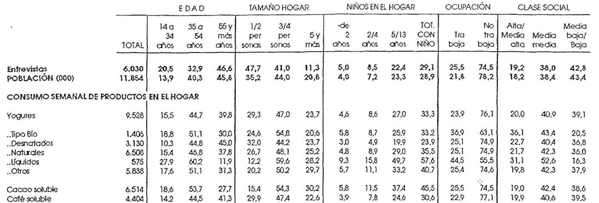
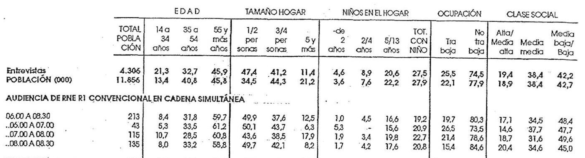

# mediaPlanR: descripción general

> **mediaPlanR** proporciona un conjunto completo de herramientas para la planificación de medios publicitarios -preferentemente en prensa-, implementando diversos modelos para estimar la cobertura, distribución de contactos y acumulación de audiencia.

El paquete **mediaPlanR** incluye implementaciones de modelos clásicos de planificación de medios como Sainsbury, Binomial, Beta-Binomial, CAE, Metheringham o Hofmans, así como permite el cálculo de las métricas clásicas en la planificación de medios.

## Instalación

La forma más sencilla de instalar y configurar **mediaPlanR** es usando las siguientes instrucciones:

```r
# Instalar el paquete devtools si no está instalado
if (!requireNamespace("devtools", quietly = TRUE)) {
  install.packages("devtools")
}

# Instalar mediaPlanR
devtools::install_github("majesus/mediaPlanR", force = TRUE, upgrade = "never")
```

## Funciones

En general, las funciones en R son bloques de código reutilizables que:

- Aceptan argumentos de entrada (parámetros)
- Ejecutan operaciones específicas usando esos argumentos
- Retornan un resultado

Sintaxis básica:

```r
nombre_funcion <- function(arg1, arg2, ...) {
  # Operaciones
  return(resultado)
}
```

Las características principales de las funciones son:

- Los argumentos pueden tener valores por defecto. Una función puede tener argumentos opcionales con valores predeterminados. Si no se especifica un valor al llamar la función, se usa el valor por defecto.
- Pueden retornar múltiples tipos de datos (números, vectores, listas, etc.)
- Tienen su propio entorno local de variables. Las variables creadas dentro de una función solo existen mientras esta se ejecuta.
- Se pueden anidar y combinar entre sí, es decir, las funciones pueden usar otras funciones en su código.
- Son objetos que se pueden asignar a variables.

En particular, las funciones incluidas en el paquete están organizadas en diferentes categorías según su propósito principal. A continuación se presenta una descripción general de las funciones disponibles:

**Modelos:** 

- calc_sainsbury() 
- calc_beta_binomial()
- calc_binomial() 
- calc_hofmans()
- calc_MBBD()
- calc_metheringham() 
- calc_R1_R2()

**Métricas:** 

- calcular_metricas_medios() 
- calc_cpm()
- calc_grps()
- plot_grp_metricas()

**Optimización / Evaluación:** 

- optimizar_d()
- optimizar_dc()
- optimize_media_plan()

**Aplicaciones Shiny:** 

- run_aud_util_explorer()
- run_beta_binomial_explorer() 
- run_reach_converg_explorer()

## Estimación de Cobertura y Distribución

### Fundamentos y Consideraciones Iniciales

### Clasificación según Enfoque Metodológico

#### Modelos Empíricos (ad hoc)

Estos modelos se caracterizan por:

- Buscar funciones matemáticas que se ajusten a los datos de audiencia disponibles
- No considerar la naturaleza probabilística de la exposición
- Enfocarse en reproducir la evolución de la cobertura según el número de inserciones

**Limitaciones principales**:

- No proporcionan información sobre la distribución de exposición
- No permiten determinar la campaña óptima al no considerar la frecuencia de exposición

#### Modelos Estocásticos

Estos modelos se distinguen por:

- Representar los patrones de audiencia mediante distribuciones de probabilidad
- Considerar la exposición como fenómeno aleatorio
- Asumir probabilidades individuales de exposición

**Características clave**:

- Requieren hipótesis adicionales sobre la probabilidad individual
- Las hipótesis específicas diferencian los distintos modelos estocásticos

La selección del modelo de estimación debe basarse en un análisis riguroso que considere:

- Las hipótesis subyacentes
- El tipo de plan de medios a evaluar
- La precisión requerida en las estimaciones
- Los recursos disponibles para la implementación

La elección de un modelo de estimación de cobertura y distribución de exposición requiere una comprensión de las hipótesis subyacentes. Estas hipótesis, que simplifican la realidad para facilitar la modelización, tienen un impacto directo en la precisión de las estimaciones. En este capítulo, examinaremos las diferentes hipótesis y tipos de modelos disponibles.

### Hipótesis sobre las Probabilidades de Exposición

#### Estacionariedad de las Probabilidades de Exposición

La hipótesis de estacionariedad se puede desglosar en dos componentes:

1. **Estacionariedad respecto a los individuos**: la probabilidad de que un individuo sea expuesto a una inserción publicitaria en particular no depende de si ha estado expuesto a inserciones anteriores.

2. **Estacionariedad respecto a las inserciones**: la probabilidad de exposición de un individuo i a una inserción N no está influenciada por la probabilidad de exposición de otro individuo j a la misma inserción.

#### Otras Hipótesis Fundamentales

- **Homogeneidad de la población**: asume que todos los individuos de la población, más allá de sus cualidades, tienen igual probabilidad de exposición a un soporte.

- **Homogeneidad de los soportes**: considera que todos los soportes del plan de medios tienen igual capacidad de generar exposición, comparten la misma probabilidad de exposición.

- **Aleatoriedad de la duplicación**: establece que la probabilidad de exposición a un soporte es independiente de la exposición a otros soportes.

- **Aleatoriedad de la acumulación**: postula que la probabilidad de exposición a una inserción en un soporte es independiente de la exposición anterior a otras inserciones.

### Clasificación de modelos según soportes e inserciones

Los modelos se pueden clasificar en tres categorías principales según su aplicación:

1. **Modelos de Acumulación de Audiencias**
   
   - Diseñados para planes con $n$ inserciones en un único soporte
   - Focalizados en el efecto acumulativo de exposiciones repetidas

2. **Modelos de Duplicación de Audiencias (o Cobertura neta)**
   
   - Aplicables a planes con una inserción en $n$ soportes diferentes
   - Centrados en el efecto de la exposición a través de múltiples soportes

3. **Modelos de Cobertura Neta Acumulada**
   
   - Desarrollados para planes con $n$ inserciones en $m$ soportes diferentes
   - Combinan los efectos de acumulación y duplicación

La comprensión de estos aspectos permite una elección informada que optimiza el balance entre precisión y complejidad del modelo.

# Modelos de estimación de la cobertura y distribución de exposición

# Modelo de Sainsbury (`calc_sainsbury`)

**Modelo de duplicación de audiencias o cobertura neta**

La función calc_sainsbury() implementa el modelo de Sainsbury, desarrollado por E. J. Sansbury en la London Press Exchange, para calcular la cobertura y la distribución de contactos para un conjunto de soportes publicitarios y una única inserción por soporte.

El modelo considera la duplicación aleatoria, las probabilidades individuales de exposición homogéneas, y las probabilidades de exposición del soporte heterogéneas para una estimación más precisa de la cobertura y la distribución de contactos (y acumulada). De las dos últimas hipótesis se deriva que la probabilidad de que un individuo resulte expuesto al soporte i vendrá dado por el cociente entre la audiencia del soporte i (casos favorables) y la población (casos totales). Por su parte, de la asunción de la duplicación aleatoria se deriva que la probabilidad de exposición continuará siendo una variable Bernouilli con diferentes probabilidadades de exposición en cada soporte.

## Características

- Considera la independencia entre soportes, es decir, la exposición a un soporte no modifica la probabilidad de resultar expuesto a otro (duplicación aleatoria)
- Asume que las probabilidades de exposición individuales son homogéneas
- Las probabilidades de exposición edl soporte son heterogéneas

Para el cálculo de la cobertura neta (probabilidad de al menos 1 contacto) empleamos la siguiente expresión:

$$C = 1 - \prod_{i=1}^{n} \left(1 - \frac{A_i}{P}\right)$$

Donde:

- C es la cobertura
- n es el número de soportes
- Ai es la audiencia del soporte i
- P es la población total

Aplicando la función de Sainsbury (simplificado) a los datos anteriormente expuestos, este sería el valor (en tanto por uno) de la cobertura neta:

$Cobertura_{neta} = 1 - (1-0,30) \times (1-0,20) \times (1-0,15) = 0,524$

Distribución de contactos (probabilidad de exactamente k contactos):

$$P(X=k) = \sum_{|S|=k} \prod_{i \in S} p_i \prod_{j \notin S} (1-p_j)$$

Donde:

- \|S\| = k significa que sumamos sobre todas las combinaciones posibles de k soportes
- pi es la probabilidad de exposición al soporte i (Ai/P)
- El primer producto corresponde a las probabilidades de exposición a los soportes i
- El segundo producto corresponde a las probabilidades de no exposición a los soportes j

## Aplicación de la función

```r
> library(mediaPlanR)
> audiencias <- c(300000, 400000, 200000)  
> pob_total <- 1000000                     
> resultado <- calc_sainsbury(audiencias, pob_total)
> resultado

MODELO SAINSBURY
================
Descripción: Modelo que considera independencia entre soportes y heterogeneidad de soportes

MÉTRICAS PRINCIPALES:
--------------------
Cobertura total: 66.40% (664000 personas)

DISTRIBUCIÓN DE CONTACTOS:
-------------------------
(Porcentaje de población que recibe exactamente N contactos)
1 contacto: 45.20% (452000 personas)
2 contactos: 18.80% (188000 personas)
3 contactos: 2.40% (24000 personas)

DISTRIBUCIÓN ACUMULADA:
----------------------
(Porcentaje de población que recibe N o más contactos)
>= 1 contacto: 66.40% (664000 personas)
>= 2 contactos: 21.20% (212000 personas)
>= 3 contactos: 2.40% (24000 personas)

RESUMEN ESTADÍSTICO:
-------------------
Promedio de contactos por individuo alcanzado: 1.36
```

# Modelo Binomial (`calc_binomial`)

**Modelo de duplicación de audiencias o cobertura neta**

La función calc_binomial() Implementa el modelo Binomial, desarrollado por Chandon (1985), para calcular la cobertura y distribución de contactos (y acumulada) de plan de medios de n soportes y una única inserción por soporte. El modelo Binomial asume la duplicación aleatoria (*i.e.*,la exposición a un soporte no modifica la probabilidad de resultar expuesto a otro), y la homogeneidad de las probabilidades de exposición del soporte y las probabilidades individuales de exposición. Uniendo estas dos hipótesis últimas, la probabilidad de exposición de cualquier individuo a un soporte determinado se calcula como la media de las audiencias de cada soporte. Las probabilidades de exposición son estacionarias respecto al tiempo.

## Características

- Cada individuo de la población tiene la misma probabilidad de exposición a un soporte i
- La probabilidad de exposición a cada soporte es la misma para cada uno de ellos
- La duplicación de las audiencias es un suceso aleatorio
- Las probabilidades de exposición son estacionarias

Para el cálculo de la cobertura neta (probabilidad de al menos 1 contacto) empleamos la siguiente expresión:

$$p = \frac{1}{P} \sum_{i=1}^{n} \frac{A_i}{n}$$

Donde:

- p es la probabilidad _promedio_ de éxito
- n es el número de soportes (1 inserción por soporte)
- Ai es la audiencia del soporte i
- P es la población total

Distribución de contactos (probabilidad de exactamente k contactos):

$$P(X=k) = \binom{n}{k} p^k (1-p)^{n-k}$$

Donde:

- k es el número de contactos
- n es el número de soportes
- p es la probabilidad media calculada anteriormente

## Aplicación de la función

```r
> library(mediaPlanR)
> audiencias <- c(300000, 400000, 200000)  
> pob_total <- 1000000                     
> resultado <- calc_binomial(audiencias, pob_total)
> resultado

MODELO BINOMIAL
===============
Descripción: Modelo que asume independencia entre soportes y homogeneidad

MÉTRICAS PRINCIPALES:
--------------------
Cobertura total: 65.70% (657000 personas)
Probabilidad media de exposición: 0.300

DISTRIBUCIÓN DE CONTACTOS:
-------------------------
(Porcentaje de población que recibe exactamente N contactos)
1 contacto: 44.10% (441000 personas)
2 contactos: 18.90% (189000 personas)
3 contactos: 2.70% (27000 personas)

DISTRIBUCIÓN ACUMULADA:
----------------------
(Porcentaje de población que recibe N o más contactos)
>= 1 contacto: 65.70% (657000 personas)
>= 2 contactos: 21.60% (216000 personas)
>= 3 contactos: 2.70% (27000 personas)

RESUMEN ESTADÍSTICO:
-------------------
Promedio de contactos por individuo alcanzado: 1.37
```

# Modelo Beta-Binomial (`calc_beta_binomial`)

La función Beta-Binomial implementa el modelo Beta-Binomial para calcular la acumulación de audiencia y la distribución de exposición (y acumulada). El modelo Beta-Binomial considera la heterogeneidad en la probabilidad de exposición de los individuos. Combina dos pasos: modela la probabilidad de éxito aplicando la distribución Beta de parámetros \alpha y \beta -lo cual reduce a dos los datos necesarios para su estimación; y emplea la probabilidad en la distribución Binomial (combinada con la distribución Beta) para valorar la distribución de contactos (y acumulada). Es útil cuando la probabilidad de éxito no es conocida a priori, y puede variar entre los individuos. Los parámetros \alpha y \beta precisamente permiten ajustar la forma de la distribución para que refleje la incertidumbre en relación con la probabilidad de éxito.

## Características

- Modela heterogeneidad de la población en sus probabilidades de exposición
- La acumulación de audiencias no es aleatoria
- Asume la estacionariedad (estabilidad en el tiempo) de las probabilidades de exposición respecto a los individuos o a las inserciones
- Requiere datos de audiencias acumuladas (A1 y A2)

La distribución de contactos (probabilidad de exactamente k contactos) se estima del modo siguiente:

$$P(X=k|n,\alpha,\beta) = \binom{n}{k} \frac{B(k+\alpha, n-k+\beta)}{B(\alpha, \beta)}$$

A continuación, se profundiza en la interpretación de la distribución Beta-Binomial.

**¿Qué modela la distribución beta en este contexto?** La distribución beta modela la heterogeneidad de las probabilidades individuales de exposición (p) en la población. No es una distribución para cada individuo, sino una única distribución que describe cómo varían las probabilidades entre individuos.

**¿Cómo se asignan las probabilidades individuales?** Cada individuo "extrae" su probabilidad p de la distribución beta común Beta($\alpha$,$\beta$). Una vez asignada, esta p se mantiene constante para ese individuo (estacionariedad).

En el ejemplo de una campaña publicitaria para un nuevo modelo de coche, la distribución Beta permitiría:

- Identificar a los **entusiastas de los coches**: Asignar una alta probabilidad de exposición a los individuos que, según los datos de audiencia, consumen habitualmente medios relacionados con el automóvil.
- Identificar a los que **no tienen interés en los coches**: Asignar una baja probabilidad de exposición a los individuos que no muestran ningún interés en este tipo de productos o medios.
- Representar la **diversidad**: Asignar una gama de probabilidades intermedias al resto de la población, reflejando la variedad de niveles de interés que pueden existir.

**¿Cómo funciona el proceso de exposición?** Para cada individuo con su p fija:

* La probabilidad p proviene de Beta($\alpha$,$\beta$)
* Las exposiciones siguen Binomial(n,p)

Matemáticamente: P(X=k) = C(n,k)B($\alpha$+k,$\beta$+n-k)/B($\alpha$,$\beta$)

**¿Por qué no es aleatoria la acumulación?** Porque las probabilidades individuales son persistentes y provienen de una distribución que modela la heterogeneidad poblacional, no de un proceso puramente aleatorio.

Se desarrolla del modo siguiente:

<br>

$$P_i = \binom{n}{i} \left[ \frac{\prod_{j=1}^{i} (\alpha + i - j) \prod_{j=1}^{n-i} (\beta + n  - i - j)}{\prod_{j=1}^{n} (\alpha + \beta + n - j)} \right]$$

<br><br>

$$P_i = \binom{n}{i} \frac{(\alpha + i - 1)(\alpha + i - 2) \cdots \alpha \cdot (\beta + n - i - 1)(\beta + n - i - 2) \cdots \beta}{(\alpha + \beta + n - 1)(\alpha + \beta + n - 2) \cdots (\alpha + \beta)}$$

<br>

Donde:

- i es el número de contactos
- n es el número de inserciones
- $\alpha$ (alpha) controla la asimetría hacia valores altos de probabilidad
- $\beta$ (beta) controla la asimetría hacia valores bajos de probabilidad

$$\alpha = \frac{R_1(R_2 - R_1)}{2R_1 - R_1^2 - R_2}$$

$$\beta = \alpha \frac{1 - R_1}{R_1}$$

Donde:

- R1 es la proporción de audiencia alcanzada (al menos 1 vez) tras la primera inserción
- R2 es la proporción de audiencia alcanzada (al menos 2 veces) tras la segunda inserción

## Aplicación de la función

```r
resultado <- calc_beta_binomial(
  A1 = 500000,    
  A2 = 550000,    
  P = 1000000,    
  n = 5           
)
resultado

# MODELO BETA-BINOMIAL
# ===================
# Descripción: Modelo que considera heterogeneidad en la población

# MÉTRICAS PRINCIPALES:
# --------------------
# Cobertura total: 60.34% (603365 personas)

# PARÁMETROS DEL MODELO:
# ---------------------
# Alpha: 0.125 (forma de la distribución beta)
# Beta: 0.125 (forma de la distribución beta)
# Probabilidad de 0 contactos: 39.66%

# DISTRIBUCIÓN DE CONTACTOS:
# -------------------------
# (Porcentaje de población que recibe exactamente N contactos)
# 1 contacto: 6.01% (60096 personas)
# 2 contactos: 4.33% (43269 personas)
# 3 contactos: 4.33% (43269 personas)
# 4 contactos: 6.01% (60096 personas)
# 5 contactos: 39.66% (396635 personas)

# DISTRIBUCIÓN ACUMULADA:
# ----------------------
# (Porcentaje de población que recibe N o más contactos)
# >= 1 contacto: 60.34% (603365 personas)
# >= 2 contactos: 54.33% (543269 personas)
# >= 3 contactos: 50.00% (500000 personas)
# >= 4 contactos: 45.67% (456731 personas)
# >= 5 contactos: 39.66% (396635 personas)

# RESUMEN ESTADÍSTICO:
# -------------------
# Promedio de contactos por individuo alcanzado: 4.14
# Media teórica de la distribución beta: 0.500
```

# Modelo de Metheringham (`calc_metheringham`)

El modelo de Metheringham es un modelo estocástico para calcular la cobertura y la distribución de contactos de un plan de medios publicitarios. Fue desarrollado por Richard Metheringham en 1964. El modelo es particularmente útil porque permite evaluar planes de medios complejos donde hay múltiples inserciones distribuidas en diferentes soportes, considerando cómo la audiencia se acumula y se duplica entre diferentes medios.

Se sustentan las siguientes hipótesis:

- La **población es heterogénea**. Cada individuo tiene su propia probabilidad personal de exposición que, sin embargo, se distribuye como una Beta para el conjunto.

- Los **soportes son homogéneos**. Ello no quiere decir que cada individuo tenga la misma probabilidad de exposición respecto a cada soporte, sino que estas probabilidades individuales se distribuyen de tal forma que todos los soportes acaban con la misma distribución Beta de probabilidades de exposición. Metheringham simplifica esta suposición utilizando la audiencia media de todos los soportes para calcular la probabilidad de exposición. Esta simplificación puede no ser realista en la práctica, ya que hay medios con mayor alcance que otros; sin embargo, facilita el cálculo al homogeneizar el conjunto de medios.
  
    Volviendo al ejemplo de la campaña del coche nuevo, la hipótesis de soportes homogéneos implicaría que, si bien algunos individuos pueden ser más propensos a ver el anuncio en la televisión, otros en revistas especializadas y otros en sitios web de coches, la distribución general de probabilidades de exposición a lo largo de todos estos soportes seguiría una forma similar (la distribución beta).

- La **acumulación y duplicación de las audiencias se promedian entre los soportes para conformar un soporte “tipo”**.

- Las **probabilidades de exposición son estacionarias** en el tiempo.

El proceso comienza calculando la **audiencia promedio de todos los soportes** involucrados en el plan de medios. Para esto, se considera tanto la audiencia individual de cada soporte como el número de inserciones que se realizan en cada uno. Después, se analiza la **audiencia acumulada que se obtiene tras dos inserciones** en lo que llaman un soporte "tipo". Este cálculo toma en cuenta dos factores: las acumulaciones (cuando las inserciones se hacen en el mismo soporte) y las duplicaciones (cuando se hacen en soportes diferentes). Con estos datos de audiencia, se estiman dos parámetros fundamentales (\alpha y \beta) que caracterizan la distribución Beta del modelo. Estos parámetros permiten calcular tanto la distribución de contactos como la cobertura total del plan de medios.

## Aplicación de la función

```r
matriz_dup <- matrix(c(
  150000, 200000, 180000,
  200000, 120000, 140000,
  180000, 140000, 170000
), nrow = 3, byrow = TRUE)

metricas <- calc_metheringham(
  audiencias = c(1500000, 800000, 1200000),
  inserciones = c(4, 3, 5),
  matriz_duplicacion = matriz_dup,
  ayuda = FALSE
)

str(metricas)

# List of 7
 # $ audiencia_media     : num 1200000
 # $ duplicacion_media   : num 167576
 # $ audiencia_segunda   : num 2232424
 # $ matriz_oportunidades: num [1:3, 1:3] 6 12 20 12 3 15 20 15 10
 # $ vector_oportunidades: num [1:6] 6 12 20 3 15 10
 # $ vector_duplicacion  : num [1:6] 150000 200000 180000 120000 140000 170000
 # $ total_inserciones   : num 12

resultado <- calc_beta_binomial(A1 = metricas$audiencia_media, 
                                A2 = metricas$audiencia_segunda, 
                                P = 10000000, 
                                n = metricas$total_inserciones)
resultado

# MODELO BETA-BINOMIAL
# ===================
# Descripción: Modelo que considera heterogeneidad en la población

# MÉTRICAS PRINCIPALES:
# --------------------
# Cobertura total: 74.34% (7434177 personas)

# PARÁMETROS DEL MODELO:
# ---------------------
# Alpha: 5.255 (forma de la distribución beta)
# Beta: 38.537 (forma de la distribución beta)
# Probabilidad de 0 contactos: 25.66%

# DISTRIBUCIÓN DE CONTACTOS:
# -------------------------
# (Porcentaje de población que recibe exactamente N contactos)
# 1 contacto: 32.66% (3266285 personas)
# 2 contactos: 23.15% (2315123 personas)
# 3 contactos: 11.78% (1177773 personas)
# 4 contactos: 4.70% (470073 personas)
# 5 contactos: 1.53% (152862 personas)
# 6 contactos: 0.41% (41064 personas)
# 7 contactos: 0.09% (9099 personas)
# 8 contactos: 0.02% (1638 personas)
# 9 contactos: 0.00% (232 personas)
# 10 contactos: 0.00% (25 personas)
# 11 contactos: 0.00% (2 personas)
# 12 contactos: 0.00% (0 personas)

# DISTRIBUCIÓN ACUMULADA:
----------------------
# (Porcentaje de población que recibe N o más contactos)
# >= 1 contacto: 74.34% (7434177 personas)
# >= 2 contactos: 41.68% (4167893 personas)
# >= 3 contactos: 18.53% (1852769 personas)
# >= 4 contactos: 6.75% (674996 personas)
# >= 5 contactos: 2.05% (204923 personas)
# >= 6 contactos: 0.52% (52061 personas)
# >= 7 contactos: 0.11% (10996 personas)
# >= 8 contactos: 0.02% (1897 personas)
# >= 9 contactos: 0.00% (259 personas)
# >= 10 contactos: 0.00% (26 personas)
# >= 11 contactos: 0.00% (2 personas)
# >= 12 contactos: 0.00% (0 personas)

# RESUMEN ESTADÍSTICO:
-------------------
# Promedio de contactos por individuo alcanzado: 1.94
# Media teórica de la distribución beta: 0.120
```

# Modelo de Hofmans (`calc_hofmans`)

El modelo de Hofmans (1966) aborda específicamente el problema de la acumulación de audiencias para múltiples inserciones en un mismo soporte. Su aportación fundamental radica en adaptar la formulación de Agostini (1961), diseñada originalmente para el cálculo de cobertura entre diferentes soportes, al caso de inserciones sucesivas en un único soporte.

El modelo se basa en dos supuestos simplificadores fundamentales: la constancia de la audiencia del soporte para todas sus inserciones, y la existencia de una duplicación constante entre cualquier par de inserciones. Su principal innovación es el reconocimiento y corrección del comportamiento no lineal de la acumulación de audiencias mediante la introducción de un parámetro de ajuste ($\alpha$) que modifica el factor de acumulación según el número de inserciones.

Para su aplicación práctica, el modelo requiere únicamente conocer las coberturas de las dos primeras inserciones, permitiendo estimar la cobertura para cualquier número posterior de inserciones. Esta estructura lo hace especialmente útil para la planificación de campañas con múltiples inserciones en un mismo soporte, ofreciendo una estimación más precisa del comportamiento real de la acumulación de audiencias a medio y largo plazo.

## Características

Objetivo del modelo:

- Calcular la audiencia acumulada de múltiples inserciones en un único soporte

Supuestos fundamentales:

- La audiencia de un soporte es constante para todos sus números
- La duplicación entre dos inserciones cualesquiera es constante e igual a d
- La duplicación no depende de qué par de inserciones estemos considerando
- Para N = 3: Usa una formulación directa
- Para N \> 3: Incorpora el parámetro \alpha para ajustar el comportamiento no lineal
- \alpha es un parámetro de ajuste que mejora la precisión del modelo para un número de inserciones mayor que 3, corrigiendo la suposición inicial errónea de que k era constante.

Datos de partida:

- R1: Cobertura de la primera inserción (proporción entre 0 y 1)
- R2: Cobertura acumulada tras la segunda inserción (proporción entre 0 y 1)
- N $\geq$ 3: Número de inserciones para las que queremos calcular la cobertura

El modelo calculará como datos adicionales:

- k = 2 \* R1 / R2
- d = 2 \* R1 - R2
- \alpha

------------------------------------------------------------------------

A continuación, se presenta un ejemplo ilustrativo:

- Lunes: 100,000 lectores
- Martes: 100,000 lectores
- Miércoles: 100,000 lectores

La duplicación constante significa que el número de personas que leen dos días cualesquiera es siempre el mismo. Por ejemplo:

- Entre lunes y martes: 60.000 leen ambos días
- Entre martes y miércoles: 60.000 leen ambos días
- Entre lunes y miércoles: 60.000 leen ambos días

Si no fuera constante, podría ser:

- Entre lunes y martes: 60.000 leen ambos días
- Entre martes y miércoles: 55.000 leen ambos días
- Entre lunes y miércoles: 40.000 leen ambos días

En el modelo de Hofmans, esta simplificación (duplicación constante) permite calcular:

d = 2R1 - R2

Donde:

- R1 es la cobertura de un día (por ejemplo 100.000)
- R2 es la cobertura acumulada de dos días (por ejemplo 140.000)
- d sería entonces: 2(100.000) - 140.000 = 60.000 lectores duplicados

Esta constante d se utiliza luego en la fórmula para calcular la cobertura para N inserciones, asumiendo que la duplicación entre cualquier par de días será siempre la misma.

## Aplicación de la función

```r
R1 <- 0.06    
R2 <- 0.103   
resultado <- calc_hofmans(R1, R2, N = 5)

print(resultado$results)
print(resultado$parametros)
```

# Modelo MBBD, _Morgensztern Beta Binomial Distribution_ (`calc_MBBD`)

Este modelo se basa en el procedimiento seguido por Leckenby y Boyd (1984a) en el desarrollo del modelo Hofmans Beta-Binomial, con la salvedad ya señalada de que la cobertura se estimaría mediante la fórmula propuesta por Morgensztem (1970).

Características

Estimación Iterativa de los Parámetros A y B:

- El código comienza con un valor arbitrario A$_0$ y calcula un valor inicial B$_0$
- Se realiza un ajuste de A basado en la diferencia entre la cobertura BBD y la cobertura de Morgenstern (RM)
- Se utiliza un factor de ajuste (adj_factor) para refinar el valor de A

Cálculo de la Cobertura BBD:

- El código emplea la función 'dbbinom' de la librería de distribuciones extraDistr
- Calcula la probabilidad de cero exposiciones (p_zero)
- La cobertura BBD se obtiene como (1 - p_zero)

Proceso Iterativo:

- La iteración continúa hasta que la cobertura calculada por BBD se aproxime lo suficiente a RM
- Esta convergencia es un aspecto fundamental en el ajuste del MBBD

Distribución de Contactos Final:

- Al finalizar la iteración, se calcula la distribución de contactos usando los valores finales de A y B (AF y BF)
- Esto permite modelar la distribución de contactos para distintas exposiciones según los requerimientos del modelo MBBD

Nota Importante sobre RM:

- El valor RM debe calcularse previamente usando la fórmula de Morgensztern

## Aplicación de la función

```r
resultado <- calc_MBBD(
  m = 3,                          
  insertions = c(5, 7, 4),        
  audiences = c(500000, 550000, 600000),  
  RM = 550000,                    
  universe = 1000000,             
  A0 = 0.1                        
)
```

# Optimización / Evaluación

## Optimización / Evaluación de Distribución de Contactos (`optimizar_d`)

La función evalúa la distribución de contactos publicitarios utilizando el modelo Beta-Binomial. Esta función optimiza la distribución de contactos publicitarios y calcula los coeficientes de duplicación (R1 y R2) utilizando la distribución Beta-Binomial. El proceso busca la mejor combinación de parámetros \alpha y \beta y número de inserciones que satisfaga los criterios de cobertura efectiva y frecuencia efectiva mínima (MEF/c) especificados por el usuario.

Características principales

- Calcula parámetros óptimos \alpha y \beta
- Determina número óptimo de inserciones
- Genera distribución de contactos completa
- Permite ajustar tolerancia y criterios de convergencia

Aplicación de la función

```r
resultado2 <- optimizar_d(
  Pob = 1000000,
  FE = 4,
  cob_efectiva = 600000,
  A1 = 450000,
  max_inserciones = 8,
  tolerancia = 0.03,     
  step_A = 0.01,         
  step_B = 0.01,
  min_soluciones = 20    
)

# Examinar resultados
print(head(resultado$mejores_combinaciones))
print(resultado$data)
```

## Optimización / Evaluación de Distribución de Contactos Acumulada (`optimizar_dc`)

Esta función optimiza la distribución de contactos publicitarios y calcula los coeficientes de duplicación (R1 y R2) utilizando la distribución Beta-Binomial. El proceso busca la mejor combinación de parámetros \alpha y \beta y número de inserciones que satisfaga los criterios de cobertura efectiva y frecuencia efectiva mínima (MEF) especificados por el usuario. La función calcula la cobertura acumulada para individuos que han visto el anuncio MEF o más veces.

Características principales

- Calcula parámetros óptimos \alpha y \beta
- Determina número óptimo de inserciones
- Genera distribución de contactos completa
- Permite ajustar tolerancia y criterios de convergencia

Aplicación de la función

```r
resultado <- optimizar_dc(
  Pob = 500000,
  FEM = 4,               
  cob_efectiva = 250000,
  A1 = 200000,
  max_inserciones = 10,
  tolerancia = 0.03,
  step_A = 0.05,
  step_B = 0.05,
  min_soluciones = 15
)
```

## Optimización / Evaluación de los modelos Sainsbury y Binomial (`optimize_media_plan`)

Optimiza planes de medios con restricciones mediante procesamiento por lotes.

Características:

- Permite elegir entre modelo Sainsbury o Binomial
- Maneja restricciones presupuestarias
- Permite exclusión de soportes específicos
- Trabaja con audiencias brutas o útiles

Aplicación de la función

```r
# Ejemplo con audiencia bruta y modelo Sainsbury
datos <- data.frame(
  soportes = c("Medio1", "Medio2", "Medio3"),
  audiencias = c(1000000, 800000, 600000),
  tarifas = c(50000, 40000, 30000)
)

resultado_bruto <- optimize_media_plan(
  soportes_df = datos,
  FEM = 2,
  objetivo_cobertura = 50,
  presupuesto_max = 100000,
  modelo = "sainsbury",
  usar_audiencia_util = FALSE
)

# Ejemplo con audiencia útil y modelo Binomial
datos_util <- data.frame(
  soportes = c("Medio1", "Medio2", "Medio3"),
  audiencias = c(1000000, 800000, 600000),
  tarifas = c(50000, 40000, 30000),
  indices_utilidad = c(1.2, 1.1, 0.9)
)

resultado_util <- optimize_media_plan(
  soportes_df = datos_util,
  FEM = 2,
  objetivo_cobertura = 50,
  presupuesto_max = 100000,
  modelo = "binomial",
  usar_audiencia_util = TRUE
)
```

# Casos Prácticos

## RNE

- Calcula las **audiencias útiles de RNE de 6 a 7:00, de 7 a 8:00, y de 8 a 8:30**. Emplea los índices de afinidad del producto café soluble, interesándote por las clases con índice de afinidad mayor o igual que 1.
- Una vez que hayas estimado las audiencias útiles, contrata una única inserción en cada soporte, y **estima la cobertura y la distribución de exposición (y acumulada)**.
- Haz uso del paquete **mediaPlanR**.





## MediCare

### Contexto Empresarial

MediCare, una innovadora empresa del sector salud, está a punto de lanzar al mercado español una nueva línea de productos de autocuidado y bienestar. La compañía ha desarrollado una gama de suplementos vitamínicos _premium_ que combina ingredientes naturales con tecnología de absorción avanzada.

El Director de Marketing, Carlos Ruiz, se enfrenta al reto de elegir el mercado regional más apropiado para el lanzamiento inicial y desarrollar una estrategia de medios efectiva que maximice el impacto entre una población consumidora de esta categoría de productos con un presupuesto limitado.

### Análisis de Mercado

La empresa ha realizado un estudio de mercado en tres regiones diferentes, obteniendo los siguientes índices relativos aplicables a la categoría y a su marca:

| Región  | CDI | BDI |
| ------- | --- | --- |
| Norte   | 112 | 95  |
| Centro  | 108 | 115 |
| Levante | 85  | 98  |

### Medios Disponibles

Para la campaña de lanzamiento, se han preseleccionado los siguientes soportes de prensa con los siguientes datos:

| Soporte             | Mercado | Aud. útil (000) | Aud. útil 2ª inserción (000) | Tarifa página color (€) |
| ------------------- | ------- | --------------- | ---------------------------- | ----------------------- |
| Norte Noticias      | Norte   | 595             | 620                          | 12.500                  |
| La Gaceta del Norte | Norte   | 504             | 720                          | 10.800                  |
| El Eco del Norte    | Norte   | 315             | 450                          | 7.200                   |
| Centro Diario       | Centro  | 546             | 780                          | 11.800                  |
| La Voz de Madrid    | Centro  | 476             | 680                          | 10.200                  |
| El Heraldo Central  | Centro  | 294             | 420                          | 6.900                   |
| Levante Express     | Levante | 406             | 580                          | 9.500                   |
| El Mediterráneo     | Levante | 343             | 490                          | 8.200                   |
| Diario de Levante   | Levante | 245             | 350                          | 5.800                   |

### Objetivos de Campaña

- Cobertura efectiva mínima: 7% de la población objetivo
- Frecuencia efectiva mínima: 5+ impactos
- Restricción presupuestaria: 100.000€
- Duración de campaña: 3 meses

### Tareas a Realizar

1. **Selección de Mercado**
- Analizar los índices CDI y BDI para cada región
- Justificar la elección del mercado con mayor oportunidad de marca
2. **Planificación de Medios**
- Desarrollar un plan de inserciones utilizando los soportes disponibles
- El plan debe contener un único soporte
- Calcular para cada plan:
  * Cobertura
  * Frecuencia media
  * Distribución de exposición
  * Distribución de exposición acumulada
  * GRPs del plan
  * CPM del plan
  * Coste por punto porcentual de población efectivamente alcanzada
3. **Análisis con Modelo Beta Binomial**
- Realizar un único cálculo manual para un plan básico de n inserciones
- Utilizar MediaPlanR para resto de planes con n inserciones
- Comparar resultados y eficiencia
4. **Diagnóstico y Recomendaciones**
- Evaluar si se cumplen los objetivos de cobertura y frecuencia
- Proponer ajustes si fuera necesario

### Datos Adicionales para el Cálculo

- Población objetivo en cada región:
  * Norte: 8.5 millones
  * Centro: 11.2 millones
  * Levante: 6.8 millones

## FórmulaPlus

### Contexto y Objetivo

FórmulaPlus, una marca establecida de **detergente**, lanza una campaña informativa en el mercado español utilizando una **estrategia de tres oleadas en medios impresos**, con el objetivo de comunicar mejoras en su fórmula a su base de clientes leales. La campaña en medio impreso (revistas) busca mantener y reforzar la fidelidad de sus consumidores actuales, informando sobre los beneficios mejorados del producto, con una previsión de ventas de 5.000.000€. Basándose en el método Publicidad/Ventas (P/V) típico del sector de productos de limpieza para el hogar, debe establecer un **presupuesto inicial** que debe optimizarse para lograr una **cobertura del 25%** de la población objetivo (1.000.000), asegurando una **frecuencia efectiva** en cada fase de la campaña.

La campaña se desarrollará en **revistas orientadas al hogar y gestión familiar**, con alta afinidad con el perfil de compradoras habituales de productos de limpieza.

| Revista       | Audiencia Bruta | Índice de Utilidad | Audiencia Útil | Tarifa Página Completa Color (€) |
| ------------- | --------------- | ------------------ | -------------- | -------------------------------- |
| Pronto        | 320000          | 0.85               | 272000         | 12000                            |
| Lecturas      | 290000          | 0.80               | 232000         | 11000                            |
| Semana        | 310000          | 0.75               | 232500         | 10500                            |
| Mía           | 280000          | 0.90               | 252000         | 9500                             |
| Clara         | 250000          | 0.85               | 212500         | 9000                             |
| Saber Vivir   | 400000          | 0.70               | 280000         | 8500                             |
| AR            | 230000          | 0.65               | 149500         | 8000                             |
| Casa Fácil    | 260000          | 0.80               | 208000         | 7500                             |
| Diez Minutos  | 295000          | 0.75               | 221250         | 10000                            |
| ¡Hola!        | 420000          | 0.65               | 273000         | 13500                            |
| Mi Casa       | 245000          | 0.85               | 208250         | 8000                             |
| El Mueble     | 275000          | 0.70               | 192500         | 9500                             |
| Nuevo Estilo  | 220000          | 0.60               | 132000         | 9000                             |
| Cocina Fácil  | 235000          | 0.80               | 188000         | 7000                             |
| Casa al Día   | 185000          | 0.85               | 157250         | 6500                             |
| SuperTele     | 280000          | 0.75               | 210000         | 8500                             |
| Cuore         | 265000          | 0.65               | 172250         | 9500                             |
| Qué Me Dices  | 255000          | 0.70               | 178500         | 8000                             |
| Telva Cocina  | 195000          | 0.80               | 156000         | 7500                             |
| Saber Cocinar | 210000          | 0.75               | 157500         | 7000                             |

**Tabla de Revistas con Audiencias y Tarifas (datos ficticios)**

Explicación de las Columnas:

- Audiencia Bruta: Audiencia ficticia para cada revista
- Índice de Utilidad: Proporción que representa la audiencia útil 
- Audiencia Útil: Audiencia bruta multiplicada por el índice de utilidad
- Tarifa Página Completa Color (€): Precio estimado por inserción en una página completa a color en cada revista.

### Estructura de la Campaña en Oleadas

Para maximizar la efectividad de la comunicación informativa, se estructurarán tres oleadas con inserciones en cada revista:

**Frecuencia Efectiva Recomendada para una Marca Establecida con Mensaje Informativo**

La presente planificación de medios establece una estrategia de comunicación (mensaje principal: comunicación de mejoras técnicas en la fórmula) orientada a alcanzar una cobertura del 25% sobre un universo de un millón de lectores/as primarios. La campaña se estructura en tres oleadas estratégicas durante 18 semanas, con una frecuencia efectiva mínima de 4 exposiciones por oleada.

**Análisis de Frecuencia Efectiva**

La determinación de la frecuencia efectiva se fundamenta parcialmente en el modelo de Ostrow:

Factores de Ajuste:

- Variables de Marketing (-0.2)
  
  - Marca establecida (-0.4)
  - Producto de uso diario (+0.2)

- Factores del Mensaje (+0.4)
  
  - Innovación en producto existente

- Contexto Mediático (+0.4)
  
  - Alto nivel de saturación publicitaria
  - Estrategia de pulsing, ciclo de compra regular
  - Limitaciones de repetición natural en el medio elegido (prensa)

Resultado: Frecuencia efectiva de 4 exposiciones (Base 3 + Ajuste total +0.6)

**Estructura de Campaña**

**Primera Oleada (Semanas 1-5)**

- Objetivo: Establecimiento del mensaje
- Frecuencia: 4 exposiciones
- Timing: Alineado con ciclos de compra (inicio de mes y quincena)
- Hiatus: 2 semanas

**Segunda Oleada (Semanas 8-12)**

- Objetivo: Consolidación del mensaje
- Frecuencia: 4 exposiciones
- Apoyo: Acciones promocionales complementarias
- Hiatus: 2 semanas

**Tercera Oleada (Semanas 15-18)**

- Objetivo: Consolidación del mensaje y alta notoriedad
- Frecuencia: 4 exposiciones

**Justificación Estratégica**

El mantenimiento de una frecuencia constante de ciclos de 4 exposiciones se fundamenta en:

- Alta saturación publicitaria
- Limitadas oportunidades de repetición natural en el medio elegido. Cuando se planifica en revistas, la frecuencia debe ser construida principalmente a través de inserciones pagadas, ya que no se puede contar significativamente con exposiciones adicionales naturales o espontáneas al mensaje.

**Conclusiones**

La estrategia planteada optimiza la inversión publicitaria mediante:

- Sincronización con ciclos de compra y uso
- Aprovechamiento del efecto residual entre oleadas (*carryover effects*)
- Mantención de intensidad necesaria para la comunicación de este tipo de producto (detergentes)
- Estructura temporal alineada con tres ciclos completos de compra-uso

### Cálculo de Cobertura y Distribución de Contactos

Para evaluar la **cobertura acumulada** y la **distribución de contactos**, utilizaremos los modelos **Sainsbury** y **Binomial**. Estos modelos son útiles para estimar la **cobertura neta** en campañas publicitarias, pero es importante recalcar que **estos métodos solo consideran una inserción por soporte** y la **independencia de las audiencias**, por lo cual son útiles en fase preliminar, y solo a efectos orientativos.

En suma, los resultados que obtendremos con los modelos Sainsbury y Binomial serán **preliminares y solo orientativos**. Estos resultados deberán necesariamente ser corregidos o ajustados mediante **modelos avanzados** como el **Canonical Expansion Model (CANEX)**, que permite un análisis más detallado.

### Solución: primera oleada

```r
library(mediaPlanR)
?mediaPlanR

# Vector de nombres de revistas
soportes <- c("Pronto", "Lecturas", "Semana", "Mía", "Clara", 
              "Saber Vivir", "AR", "Casa Fácil", "Diez Minutos", 
              "¡Hola!", "Mi Casa", "El Mueble", "Nuevo Estilo",
              "Cocina Fácil", "Casa al Día", "SuperTele", "Cuore",
              "Qué Me Dices", "Telva Cocina", "Saber Cocinar")

# Vector de audiencias brutas
audiencias <- c(320000, 290000, 310000, 280000, 250000, 
                400000, 230000, 260000, 295000, 420000,
                245000, 275000, 220000, 235000, 185000,
                280000, 265000, 255000, 195000, 210000)

# Vector de índices de utilidad
indices_utilidad <- c(0.85, 0.80, 0.75, 0.90, 0.85,
                      0.70, 0.65, 0.80, 0.75, 0.65,
                      0.85, 0.70, 0.60, 0.80, 0.85,
                      0.75, 0.65, 0.70, 0.80, 0.75)

# Vector de audiencias útiles
audiencias_utiles <- c(272000, 232000, 232500, 252000, 212500,
                       280000, 149500, 208000, 221250, 273000,
                       208250, 192500, 132000, 188000, 157250,
                       210000, 172250, 178500, 156000, 157500)

# Vector de tarifas
tarifas <- c(12000, 11000, 10500, 9500, 9000,
             8500, 8000, 7500, 10000, 13500,
             8000, 9500, 9000, 7000, 6500,
             8500, 9500, 8000, 7500, 7000)

# Si quieres crear un data frame con todos estos datos
datos <- data.frame(
  soportes = soportes,
  audiencias = audiencias,
  indices_utilidad = indices_utilidad,
  audiencias_utiles = audiencias_utiles,
  tarifas = tarifas
)

# Para ver el data frame completo
print(datos)

resultado_bruto <- optimize_media_plan(
  soportes_df = datos,
  FEM = 4,
  objetivo_cobertura = 25,
  poblacion_total = 1000000,
  presupuesto_max = 1200000,
  modelo = "binomial",
  usar_audiencia_util = FALSE
)
```

# Características Generales del Paquete

- Múltiples modelos de cobertura y frecuencia
- Optimización con restricciones presupuestarias
- Soporte para audiencias brutas y ponderadas
- Procesamiento por lotes para cálculos eficientes
- Salida detallada con distribuciones de contactos
- Validación y manejo de errores integrado
- Seguimiento de progreso para operaciones largas

## Manejo de Errores

El paquete incluye validación de entrada y manejo de errores:

- Validación de rangos de parámetros
- Verificaciones de consistencia
- Mensajes de error descriptivos
- Seguimiento de progreso

## Contacto y Soporte

- **Autor**: Manuel J. Sánchez-Franco
- **ORCID**: [0000-0002-8042-3550](https://orcid.org/0000-0002-8042-3550)
- **Email**: [majesus\@us.es](mailto:majesus@us.es){.email}
- **Issues**: Para reportar problemas o sugerencias, usa la sección de [Issues](https://github.com/majesus/mediaPlanR/issues)


